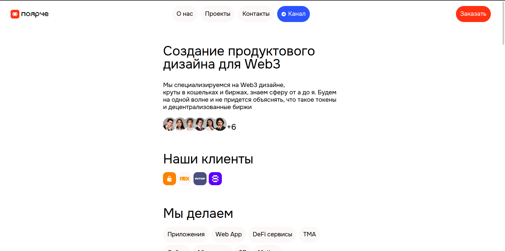
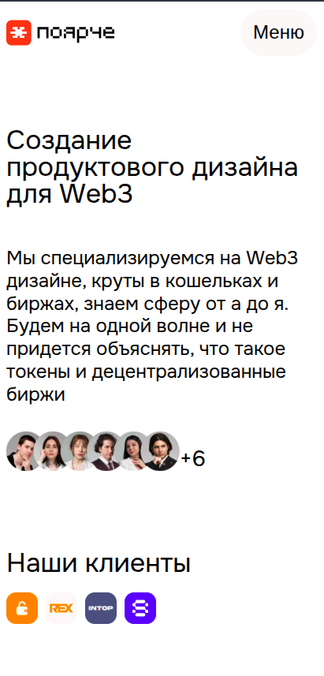

# 📰 Brighter-V3 - Design studio

A web application for a design studio, built with Next.js, powered by TypeScript and styled with custom SCSS.
The project is designed to showcase the portfolio, services, and client interactions.

---

## ✨ Preview

### Desktop version


### Mobile version


Live demo available at:  
👉 [https://brighter-v3.vercel.app/](https://brighter-v3.vercel.app/)

---

## 🛠 Technologies
- **Next.js** - server-side rendering and routing
- **TypeScript** - strict typing and efficient development
- **SCSS (Sass)** - modular styles and a clean CSS architecture

---
## 📂 Project structure
```
├── app/                # Main pages (Next.js App Router)
│   ├── about/          # "About us" page
│   ├── portfolio/      # Project portfolio
│   ├── services/       # Studio services
│   ├── contacts/       # Contacts
│   └── api/            # API routes (Next.js)
├── src/
│   ├── components/     # UI components
│   ├── data/           # Static data
│   ├── models/         # Data types and models
│   ├── resources/      # Constants, dictionaries
│   ├── shared/         # Common hooks and utilities
│   ├── styles/         # SCSS styles
│   └── utils/          # Utilities
├── public/             # Static files
└── docs/               # Documentation

```
---


## ⚡ Installation & Usage
Clone the repository:
```bash
git clone https://github.com/makaksel/unkill.git
cd unkill
```

Install dependencies:
```bash
npm install
```

Run development server:
```bash
npm run dev
```

Build the project:
```bash
npm run build
```

***


# 📰 Поярче-V3 - дизайн-студия

Веб-приложение дизайн-студии, созданное на Next.js с поддержкой TypeScript и кастомной стилизацией через SCSS.
Проект предназначен для презентации портфолио, услуг и взаимодействия с клиентами

---

## ✨ Превью

### Десктопная версия


### Мобильная версия


Онлайн-версия доступна по ссылке:  
👉 [https://brighter-v3.vercel.app/](https://brighter-v3.vercel.app/)

---

## 🛠 Технологии
- **Next.js** - серверный рендеринг и маршрутизация
- **TypeScript** - строгая типизация и удобная разработка
- **SCSS (Sass)** - модульные стили и удобная архитектура CSS
---

## 📂 Структура проекта
```
├── app/                # Основные страницы (Next.js App Router)
│   ├── about/          # Страница "О нас"
│   ├── portfolio/      # Портфолио проектов
│   ├── services/       # Услуги студии
│   ├── contacts/       # Контакты
│   └── api/            # API маршруты (Next.js)
├── src/
│   ├── action/         # Серверные запросы
│   ├── components/     # UI-компоненты
│   ├── data/           # Статические данные
│   ├── models/         # Типы и модели данных
│   ├── resources/      # Константы, словари
│   ├── shared/         # Общие хуки и утилиты
│   ├── styles/         # SCSS стили
│   └── utils/          # Утилиты
│
├── public/             # Статические файлы
└── docs/               # Документация
```
---

## ⚡ Установка и запуск
Склонировать репозиторий:
```bash
git clone https://github.com/makaksel/unkill.git
cd unkill
```

Установить зависимости:
```bash
npm install
```

Запустить режим разработки:
```bash
npm run dev
```

Запустить билд:
```bash
npm run build
```
